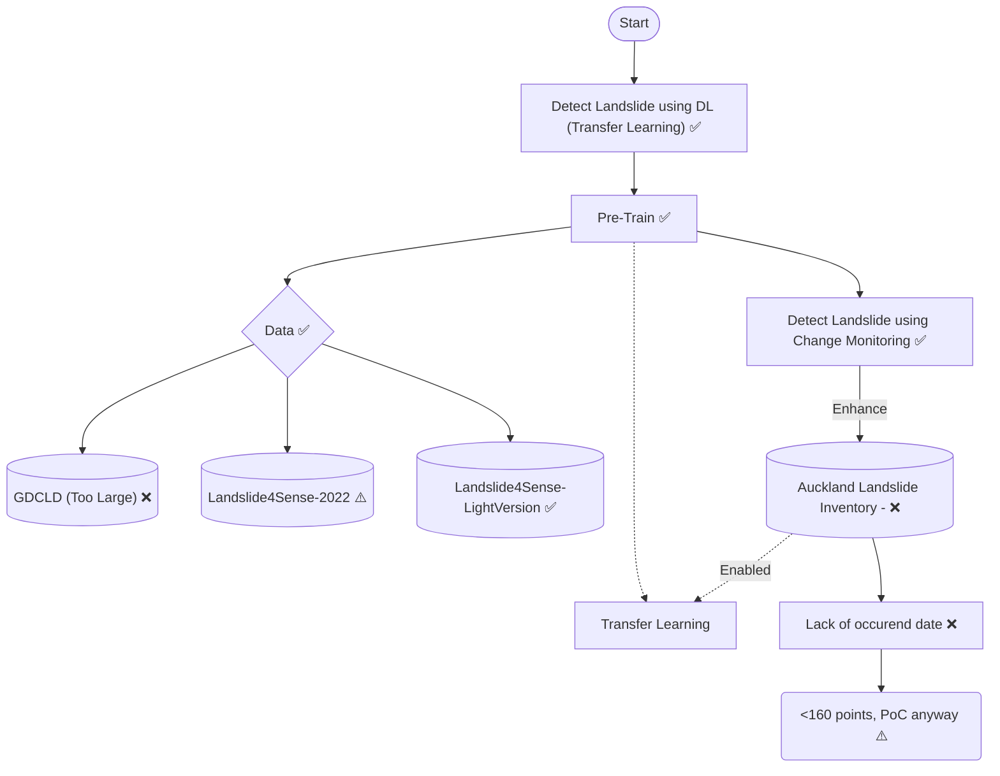
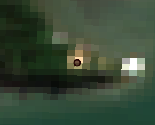
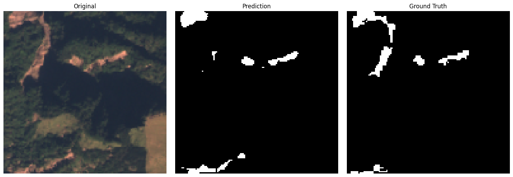
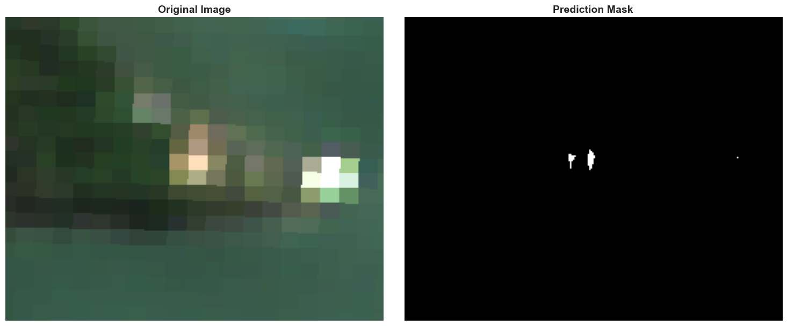
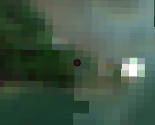
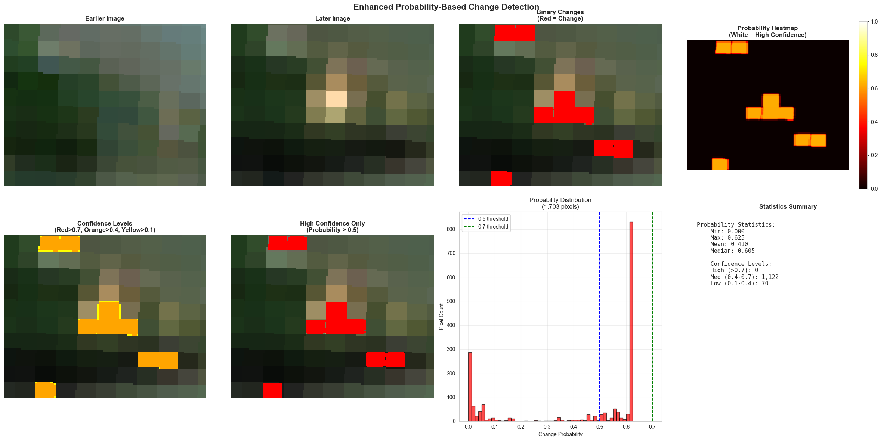

# Auckland Landslide Inventory Enhancement

This repo trying to enhance the quality of Auckland Landslide event to enabling further goal which is a pipeline that can detect landslide by continously monitoring changes

The [Original Inventory](https://www.arcgis.com/home/item.html?id=f7ca84d9c1524f99ab94e03b547cd143#data).

Tasks vusualization:

## Notebooks

### Step 0: Fetch Original Data
- Notebook: [0-data-fetching.ipynb](https://github.com/dhnhut/Landslide-DeepLearning/blob/main/0-data-fetching.ipynb) 
- Auto fetch all data from all New Zealand

### Step 1: Processing Data
- Notebook: [1-data-processing.ipynb](https://github.com/dhnhut/Landslide-DeepLearning/blob/main/1-data-processing.ipynb)
- Filter Auckland data only and save to separate `.gpkg` data file in `data` folder

### Step 2: Fetch Events Geo Data
- Notebook: [2-events-explore.ipynb](https://github.com/dhnhut/Landslide-DeepLearning/blob/main/2-events-explore.ipynb)
- Fetch all GEO Data of events that have occurence data 
- It around <160 data points

### Step 3: Landslide Segmentation using CNN model
- Notebook: [3-landslide-segmentation-CNN.ipynb](https://github.com/dhnhut/Landslide-DeepLearning/blob/main/3-landslide-segmentation-CNN.ipynb)
- Pre-train model
  - Architecture `unet`
  - Encoder_name `resnet34`
  - Dataset [Landslide Segmentation](https://www.kaggle.com/datasets/niyarrbarman/landslide-divided)
  - Sample segmentation result:
  

- Apply on Auckland data

### Step 4: Preparing for Change Monitoring
- Notebook: [4-pre-change-detection.ipynb](https://github.com/dhnhut/Landslide-DeepLearning/blob/main/4-pre-change-detection.ipynb)
- Fetch all Event before the occurence date as the input for change detection.

### Step 5: Change Detection
- Notebook: [5-change-detection.ipynb](https://github.com/dhnhut/Landslide-DeepLearning/blob/main/5-change-detection.ipynb)
- The foundation method is `Segment Anything Model`.
- Sample result

## Next steps

- Apply remote sensing knowledge to enhance model, not just design architecture.
- Replace `Segment Anything Model` to a custom model that can cover all bands of Sentinel-2 for higher accuracy. From that, the both of data quality and quantity of Landslide Inventory will be increase.
- Expand more bands for landslide detection model. And with the better Auckland dataset, we can fine-tuning or apply transfer learning for avoid distribution shift and increase model performance.
- Final goal is a pipeline that can detect landslide by continously monitoring changes.

## Notes
- All Geo images are from Sentinel-2 and applied `s2cloudless` for cloud removal.
- Input image for all models is RGB only due to Demo purpose and limited of computational resource. Therefore, the models perform not good.
- For simplicity on Python package handling, all Notebooks are put at root folder. But other functions that should be modulize for DRY and keep notebooks shorter are in `libs` folder.

## Reference

- [GeoAI](https://opengeoai.org)
  - [Change Detection](https://opengeoai.org/examples/change_detection/)
  - [Water Detection](https://opengeoai.org/examples/water_detection_s2/)
- [Segment Anything Model](https://segment-anything.com/)
- Datasets:
  - [Landslide Segmentation](https://www.kaggle.com/datasets/niyarrbarman/landslide-divided)
  - [Landslide4Sense](https://www.kaggle.com/datasets/tekbahadurkshetri/landslide4sense)
 