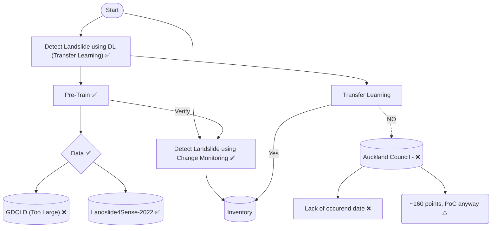

```mermaid
flowchart TD
        A(["Start"])
        A --> P1["Detect Landslide using DL (Transfer Learning) ✅"]
        P1 --> P1_pre["Pre-Train ✅"]
        P1_pre --> P1_Pre_data{"Data ✅"} 
        P1_Pre_data --> P1_GDCLD[("GDCLD (Too Large) ❌")] 
        P1_Pre_data --> P1_Landslide4Sense[("Landslide4Sense-2022 ✅")] 
        

        A --> P2["Detect Landslide using Change Monitoring ✅"]

        P2 --> Inventory[("Inventory")]
        P1_pre -- Verify --> P2

        P1 --> P1_train["Transfer Learning"]
        P1_train -. NO .-> NoTrain[("Auckland Council - ❌")]
        NoTrain --> Lack["Lack of occurend date ❌"]
        NoTrain --> LimitTrain("~160 points, PoC anyway ⚠️")

        P1_train -- Yes --> Inventory
```