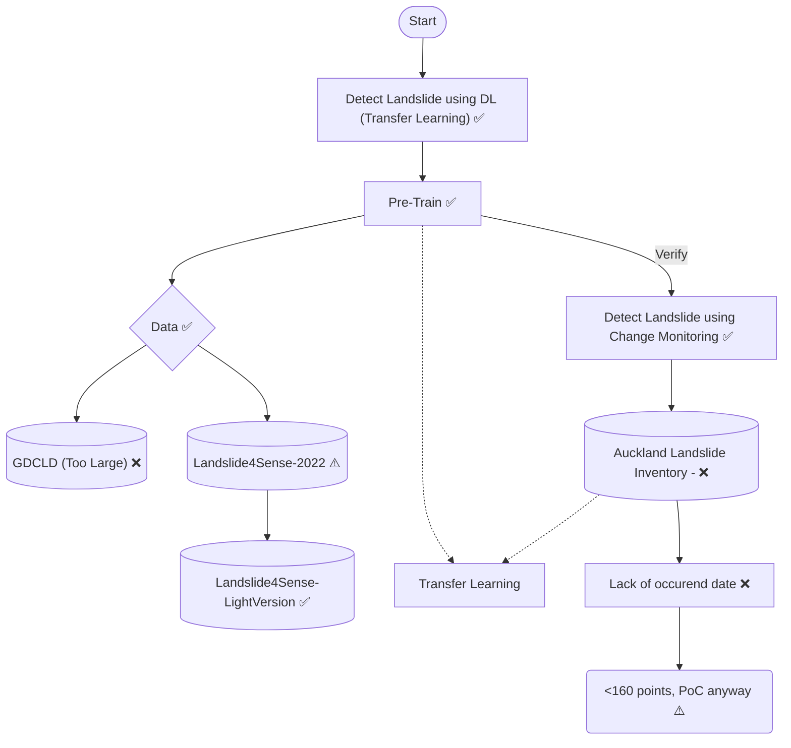

```mermaid
flowchart TD
        A(["Start"])
        A --> P1["Detect Landslide using DL (Transfer Learning) ✅"]
        P1 --> P1_pre["Pre-Train ✅"]
        P1_pre --> P1_Pre_data{"Data ✅"} 
        P1_Pre_data --> P1_GDCLD[("GDCLD (Too Large) ❌")] 
        P1_Pre_data --> P1_Landslide4Sense[("Landslide4Sense-2022 ⚠️")]
        P1_Landslide4Sense --> LightVersion[("Landslide4Sense-LightVersion ✅")]

        

        P1_pre -- Verify --> P2["Detect Landslide using Change Monitoring ✅"]
        P2 --> Inventory[("Auckland Landslide Inventory - ❌")]

        P1_pre -.-> P1_fine_tune["Transfer Learning"]
        
        Inventory --> Lack["Lack of occurend date ❌"]
        Lack --> LimitTrain("<160 points, PoC anyway ⚠️")
        Inventory -.-> P1_fine_tune

```